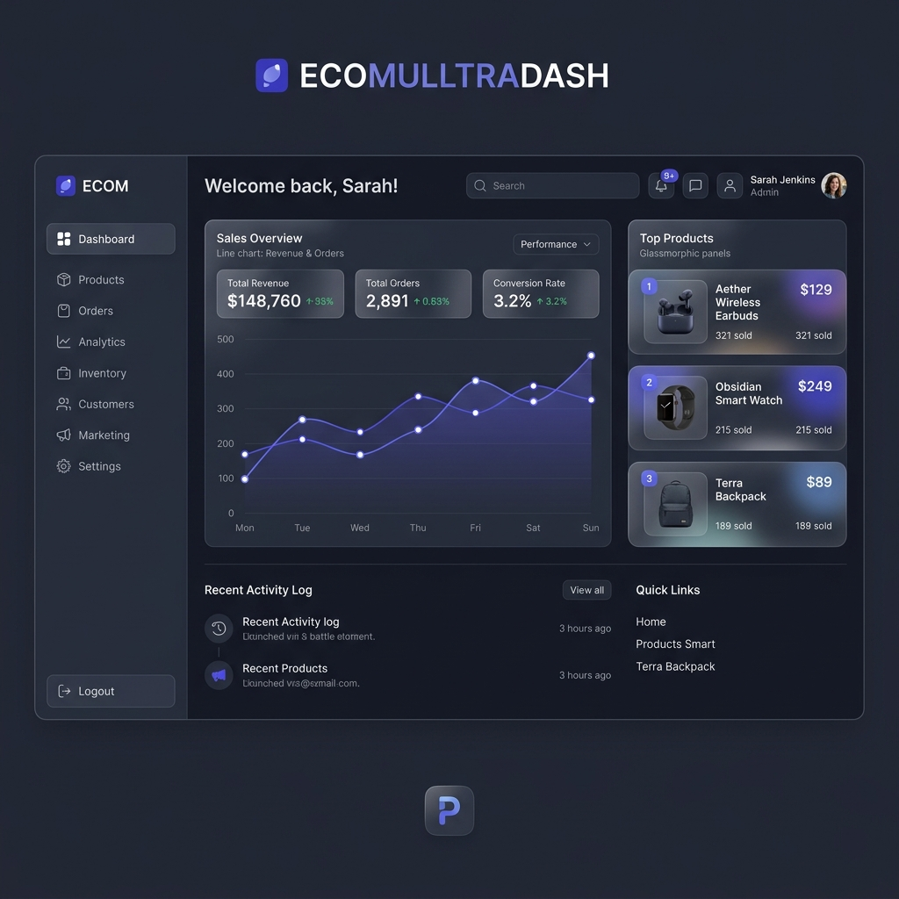

# Personal Portfolio Website on AWS EC2

🚀 A high-performance, responsive personal portfolio website built with **React** and **Vite**, optimized for cloud deployment on **AWS EC2**.



## 🌟 Features

- **Premium Design**: Modern "Glassmorphism" aesthetic with a clean dark theme.
- **Dynamic Animations**: Smooth transitions powered by `framer-motion`.
- **Iconography**: Beautiful icons from `lucide-react`.
- **Cloud Ready**: Pre-configured for deployment with **Nginx** on an **AWS EC2 (Ubuntu)** instance.
- **SEO Optimized**: Semantic HTML and meta tags included.

## 🛠️ Technology Stack

- **Frontend**: React 18, Vite
- **Styling**: Vanilla CSS (Custom Variable System)
- **Animations**: Framer Motion
- **Icons**: Lucide React
- **Deployment**: Nginx, AWS EC2

## 🚀 Getting Started

### Local Development

1. **Clone the repo**
   ```bash
   git clone <your-repo-url>
   ```
2. **Install dependencies**
   ```bash
   npm install
   ```
3. **Run the development server**
   ```bash
   npm run dev
   ```

### ☁️ Deployment on AWS EC2

Full step-by-step deployment instructions can be found in the `deployment/` folder.

1. **Build the project**
   ```bash
   npm run build
   ```
2. **Move the `dist` folder to your EC2 instance web root**.
3. **Apply the Nginx configuration** provided in `deployment/nginx.conf`.

---

Built with ❤️ for Cloud Computing Enthusiasts.
