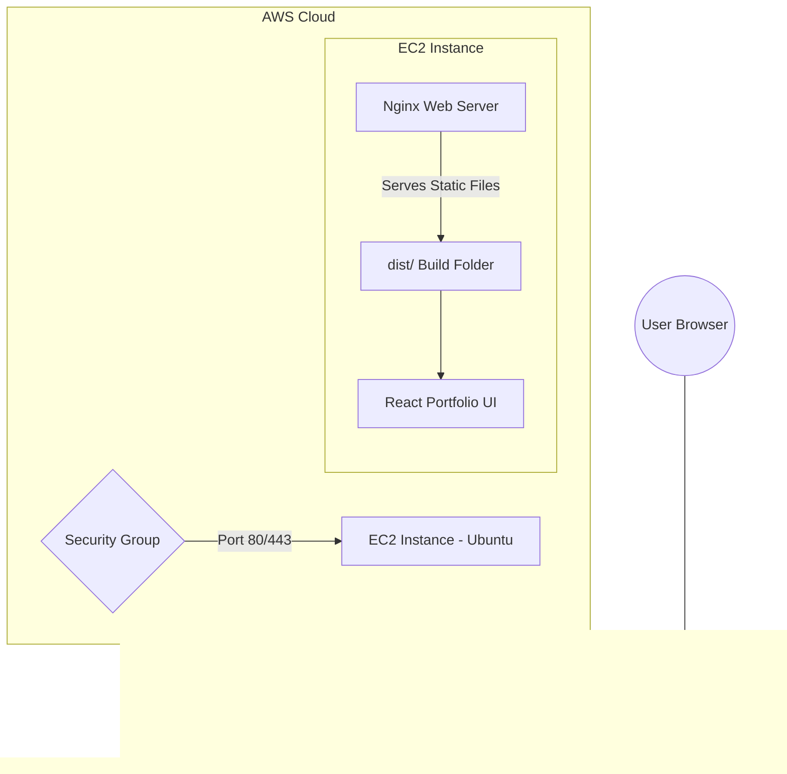

# Personal Portfolio Website on AWS EC2 🌐

Welcome to the **Personal Portfolio Website on EC2** project! This repository contains a professional but beginner-friendly portfolio website built with **React** and **Vite**, designed specifically for a **Cloud Computing Mini-Project**.

---

## 📖 Project Explanation

This project is a hands-on exploration of how modern web applications are deployed in the cloud. Instead of using automated platforms like Vercel or Netlify, we take full control of the infrastructure by using **Infrastructure as a Service (IaaS)** on AWS.

### Why this project?
For students and beginners, understanding how a server works is crucial. This project covers:
1.  **Frontend Build**: Compiling a React app into static assets.
2.  **Server Hosting**: Managing a Linux (Ubuntu) virtual server.
3.  **Reverse Proxy**: Configuring Nginx to serve files and handle traffic.
4.  **Cloud Networking**: managing Security Groups and Static IPs.

---

## 🏗️ Architecture Diagram



---

## 🛠️ Technology Stack

| Component | Technology |
| :--- | :--- |
| **Frontend Framework** | React (Vite) |
| **Styling** | Vanilla CSS (Modern Grid/Flexbox) |
| **Animations** | Framer Motion |
| **Cloud Provider** | AWS (Free Tier Eligible) |
| **Server OS** | Ubuntu 22.04 LTS |
| **Web Server** | Nginx |

---

## 🚀 Step-by-Step Installation

### 1. Local Development
```bash
# Clone the repository
git clone https://github.com/kunaljangir1/Personal-Portfolio-Website-on-EC2.git

# Navigate to the folder
cd Personal-Portfolio-Website-on-EC2

# Install dependencies
npm install

# Run locally
npm run dev

# Build for production
npm run build
```

### 2. AWS Setup
1. Launch an **EC2 t2.micro** instance (Ubuntu 22.04).
2. Configure **Security Group**: Allow Port 22 (SSH) and Port 80 (HTTP).
3. Connect via SSH: `ssh -i "your-key.pem" ubuntu@YOUR_PUBLIC_IP`.

### 3. Server Deployment
```bash
# Update server
sudo apt update && sudo apt upgrade -y

# Install Nginx
sudo apt install nginx -y

# Copy the build files from 'dist' to /var/www/portfolio
# and apply the configuration found in deployment/nginx.conf
```

---

## 📁 Repository Structure
- `src/`: React source code and components.
- `public/`: Static assets like images and icons.
- `deployment/`: Nginx server configuration files.
- `REPORT.md`: Detailed project report for academic requirements.

---

## 🛡️ License
This project is open-source and free to use for students and developers learning cloud computing. 

*Built with ❤️ by the Cloud Project Team.*
